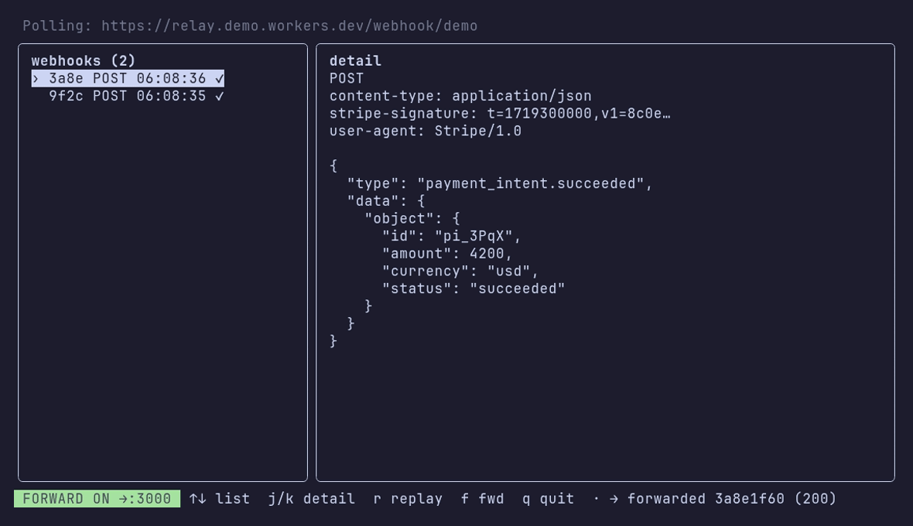

<div align="center">

# webhook-relay

**Receive webhooks on a Cloudflare Worker, then pull them down to your local app — no public tunnel, no inbound ports.**

[](https://www.npmjs.com/package/webhook-relay-cli)
[](https://www.npmjs.com/package/webhook-relay-cli)
[](LICENSE)
[](https://nodejs.org)

A live terminal UI (k9s-style) to watch, inspect, replay, and auto-forward webhooks as they arrive.



</div>

```
provider ──POST──▶ Cloudflare Worker (stores in D1)
                          ▲
                          │ poll
                     relay CLI ──forward──▶ http://localhost:<port>
```

Two parts: a **CLI** (published to npm) and a **Worker** you self-host on your
own Cloudflare account. Each user runs their own Worker, so the stored webhooks
are yours alone.

## 1. Install the CLI

```bash
npm i -g webhook-relay-cli
```

## 2. Deploy the Worker (one time)

You need a free [Cloudflare](https://dash.cloudflare.com/sign-up) account. Then:

```bash
relay deploy
```

`relay deploy` logs you in (opens your browser once), creates your own D1
database, deploys the Worker to your account, and saves its URL + a token to
`~/.webhook-relay/config.json`. The Worker creates its own table on the first
request — no migration step. Re-run it any time; it reuses your database.

<details>
<summary>Prefer to do it by hand?</summary>

```bash
cd worker
wrangler login
wrangler d1 create webhook-relay-db
# → paste the printed `database_id` into worker/wrangler.toml (it ships empty)
wrangler deploy
# → note the URL it prints, then run: relay init   (paste that URL)
```

</details>

The token is just a name that separates your webhook streams. Override the saved
config any time with `relay init`.

## 3. Point your provider at the Worker

Configure the webhook sender (GitHub, Stripe, etc.) to POST to:

```
https://webhook-relay.<you>.workers.dev/webhook/<your-token>
```

## 4. Receive locally

```bash
relay tui --port 3000      # live UI: watch, inspect, replay, auto-forward
```

## Commands

| Command | What it does |
|---------|--------------|
| `relay deploy` | Provision D1 + deploy the Worker, save its URL to config (run from a repo clone) |
| `relay init` | Save Worker URL + token to `~/.webhook-relay/config.json` |
| `relay status` | Print the current config and its path |
| `relay tui --port <n>` | Live TUI — auto-forwards to `localhost:<n>`; press `s` to edit worker/token |
| `relay listen --port <n>` | Poll + forward, no UI |
| `relay list` | List stored webhooks |
| `relay replay <id> --port <n>` | Re-send one stored webhook to localhost |
| `relay purge [--yes]` | Delete **all** stored webhooks from your Worker (irreversible) |

Most commands accept `--worker <url>` / `--token <t>` to override the saved
config.

## License

MIT — see [LICENSE](LICENSE).